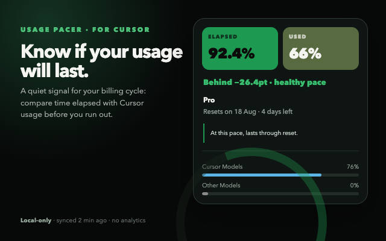

# Usage Pacer

Chrome extension that paces [Cursor](https://cursor.com) usage against the billing-cycle reset date.

Cursor usage resets on a personal billing date, not on the 1st of the month. The dashboard shows how much of the included pool is used. It does not show whether that pace will last until reset. Usage Pacer fills that gap.



This project is **not affiliated with, endorsed by, or sponsored by** Anysphere, Inc. or Cursor. Cursor is a trademark of Anysphere, Inc.

## What it shows

- **Toolbar icon** — elapsed-time ring (how far you are through the billing cycle)
- **Toolbar badge** — remaining %, pace delta, or used % (you choose), colored by pace
- **Popup** — elapsed vs used pills, days left, depletion forecast, Cursor Models / Other Models bars
- **Sync** — every 5 minutes, every 15 minutes (default), or manual only

Data stays on-device. There is no Usage Pacer backend and no analytics.

## Install

Chrome Web Store listing is not published yet. Load it unpacked:

1. Clone this repo and run `npm install` then `npm run build`.
2. Open `chrome://extensions`, enable **Developer mode**.
3. **Load unpacked** and choose the `dist/` folder.
4. Sign in at [cursor.com](https://cursor.com) in Chrome. The extension uses that existing session.

## Privacy

Usage Pacer reads whether a `cursor.com` session cookie is present, then calls Cursor's own `GET /api/usage-summary`. It does not store or log the cookie value. Full policy: [PRIVACY.md](PRIVACY.md).

## Limitations

- Unofficial. The Cursor web API can change without notice.
- Chrome only (Manifest V3).
- Needs a signed-in `cursor.com` browser session. It does not read the Cursor desktop app.

## Development

Requires Node.js 22+ and npm.

```
npm install
npm run dev       # Vite HMR for popup + worker
npm run build     # production build to dist/
npm test          # Vitest
npm run typecheck
```

Product spec: [docs/brief.md](docs/brief.md). Architecture: [docs/architecture.md](docs/architecture.md). Contributing: [CONTRIBUTING.md](CONTRIBUTING.md).

## License

[MIT](LICENSE)
