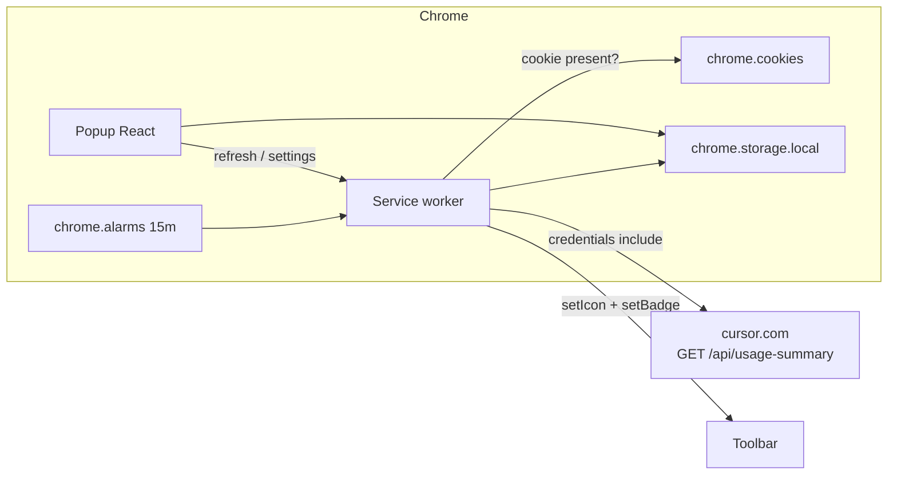

# Architecture — Usage Pacer

Chrome extension (Manifest V3). No backend. All data stays on-device.

Master product spec: [brief.md](brief.md). Fetch contract: [api-contracts.md](api-contracts.md). UI tokens: [design-system.md](design-system.md).

## Context

The extension reads the user’s existing `cursor.com` web session, pulls the current billing-cycle usage, computes a linear pace, and shows:

- Toolbar **icon**: elapsed-time ring (`averagePct` → 100% at reset)
- Toolbar **badge**: one number (remaining / delta / used) + pace color. One decimal when the text fits in 4 characters; integer otherwise.
- **Popup**: Cycle Counter-style two pills (used % vs elapsed %) plus forecast

It does not scrape the Cursor desktop app.

## System diagram

## Layers

| Layer | Path | Responsibility |
|-------|------|----------------|
| Domain | `src/domain/` | Pure pacing math and view-model. No `chrome.*`. |
| Cursor client | `src/cursor/` | Cookie presence, `usage-summary` fetch, JSON parse. |
| Cache | `src/storage/` | `chrome.storage.local` snapshot + settings. Never stores the cookie. |
| Toolbar | `src/toolbar/` | Canvas ring icon + badge text/color. |
| Background | `src/background/` | Alarm, orchestrate fetch → math → icon/badge. |
| Popup | `src/popup/` | React UI. Reads cache; can request a refresh. |

## Runtime

- **Service worker** is the only privileged context. It owns alarms, cookie checks, network, and `chrome.action.setIcon` / `setBadgeText` / `setBadgeBackgroundColor`.
- **Popup** is ephemeral. On open it reads cache, then asks the worker to refresh.
- **Host fetch:** `https://cursor.com/api/usage-summary` with `credentials: "include"`. MV3 `host_permissions` attach `httpOnly` cookies; do not copy `WorkosCursorSessionToken` into storage or logs.
- **Signed-out detection:** `chrome.cookies.get({ url: "https://cursor.com/", name: "WorkosCursorSessionToken" })` returns `null` → signed out. Use presence only; do not read or persist the value.

## Icon drawing

Draw 16×16 and 32×32 `ImageData` via `OffscreenCanvas` in the worker. Fallback: `chrome.offscreen` document if `OffscreenCanvas` is missing.

- Track: dark ring. Fill: product green arc from 12 o’clock, clockwise, `averagePct / 100` of 360°.
- Ring color is **not** pace (time ≠ usage). Pace is badge background only.
- Empty grey track when signed out with no usable cache.

## Cache schema

`chrome.storage.local` keys:

| Key | Type | Notes |
|-----|------|-------|
| `snapshot` | `UsageSnapshot` | Last successful parse of `usage-summary` plus `fetchedAt` |
| `badgeMode` | `"remaining" \| "delta" \| "used"` | Default `"remaining"` |
| `refreshInterval` | `"5min" \| "15min" \| "manual"` | Default `"15min"`. Background alarm only. |
| `lastError` | `string \| null` | Fetch/parse failure message for popup |

`UsageSnapshot.fetchedAt` is epoch ms. Stale = signed out **and** `now - fetchedAt >= 24h` → badge `—`, empty ring. Signed out **and** cache younger than 24h → dim badge + ring from snapshot.

## Refresh

- Background alarm: **5 minutes**, **15 minutes** (default), or **manual** (no alarm). Setting is `refreshInterval` in storage.
- Always: popup open, manual Refresh button, extension install/startup.
- Changing the interval updates the alarm immediately and does not fetch.

## Error states

| State | Toolbar | Popup |
|-------|---------|-------|
| OK | Ring + colored badge | Two pills + details |
| Signed out, fresh cache | Dim badge, cached ring | Sign-in prompt + last numbers |
| Signed out, stale/none | Grey `—`, empty ring | Sign-in prompt |
| Fetch/parse fail, have cache | Keep last | Error line + last synced |
| Fetch/parse fail, no cache | Grey `—` | Error + sign-in |

## Out of scope (do not build)

History chart, notifications, i18n, desktop-app scrape, storing cookies, calling extra Cursor dashboard POSTs in MVP (`usage-summary` is enough).
